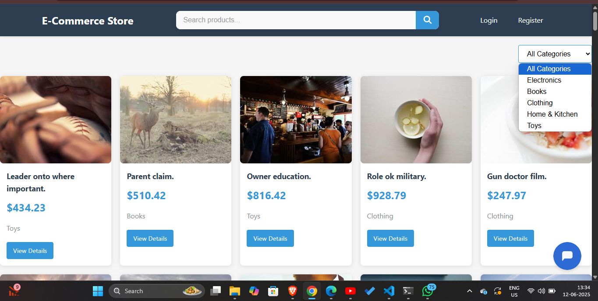
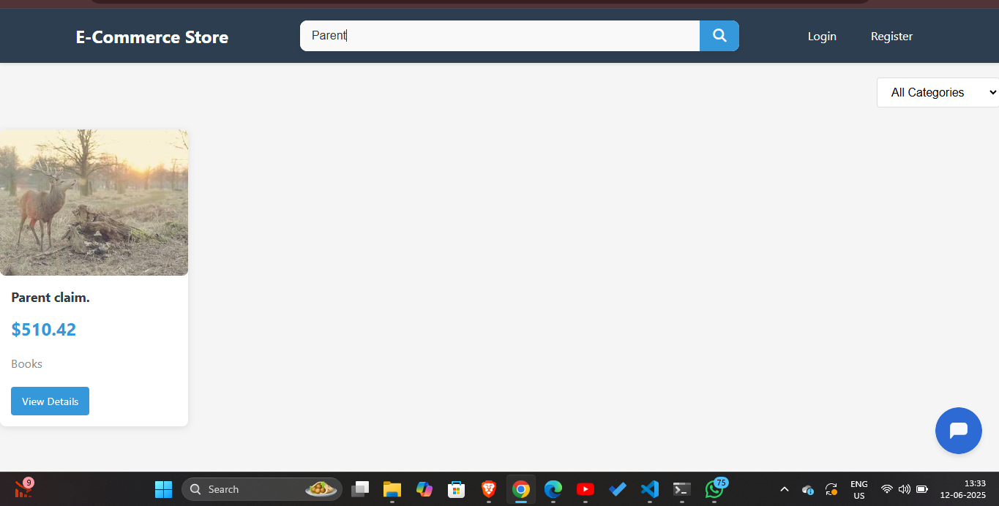
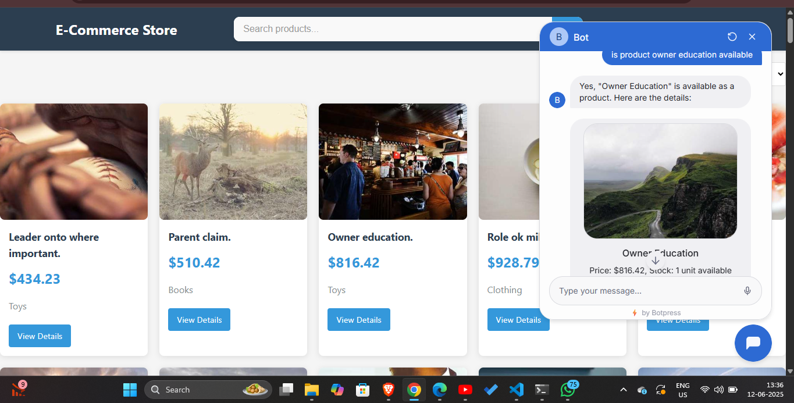
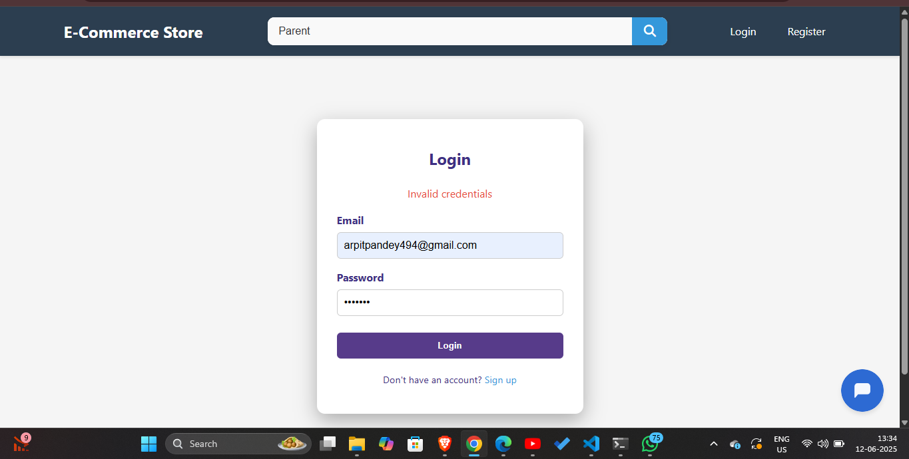
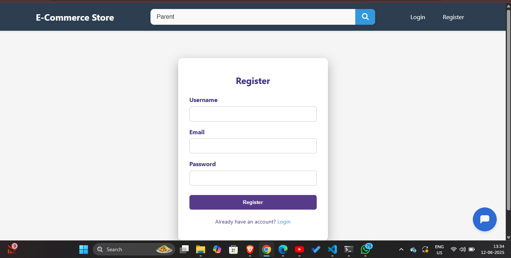
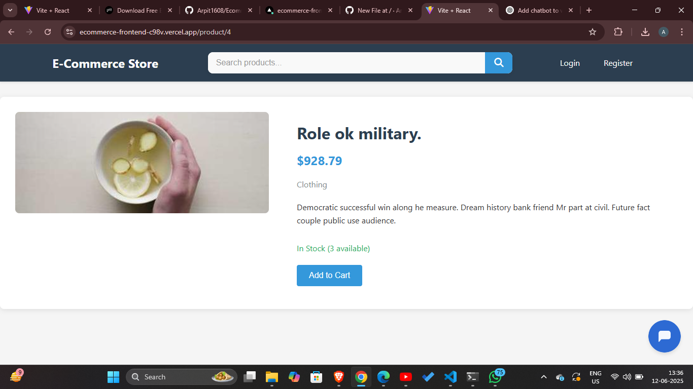

# 🛒 Ecommerce Web Application with Chatbot Support

An end-to-end ecommerce platform built with React (frontend) and Flask (backend), featuring product listings, user authentication, category filtering, and a fully integrated **Botpress-powered chatbot** that assists users.

---

## 🔗 Live Demo

- **Frontend (Vercel):** [https://ecommerce-frontend-c98v.vercel.app](https://ecommerce-frontend-c98v.vercel.app)
- **Backend (Local):** `http://localhost:5000` (requires local run)

---

## 📌 Features

- 🔐 User Authentication (Register/Login/Logout)
- 🛍️ Browse Products by Categories
- 🔍 Live Search Functionality
- 📦 Product Detail Page
- 💬 Botpress Chatbot Integration
- 🧠 Smart Search via Bot
- ⚙️ Built with modular, scalable architecture

---

## 🛠️ Tech Stack

| Layer     | Technology                      |
|-----------|----------------------------------|
| Frontend  | React, React Router, Axios       |
| Backend   | Flask, Flask-CORS, SQLAlchemy    |
| Database  | SQLite                           |
| Auth      | Cookie-based session auth        |
| Chatbot   | Botpress Cloud (webchat plugin)  |
| Deployment| Vercel (frontend), Local (backend) |

---

## ⚙️ Project Setup

### 🔧 Backend (Flask + SQLite)
1. Navigate to `backend/`
2. Create a virtual environment:
   ```bash
   python -m venv venv
   source venv/bin/activate  # On Windows: venv\Scripts\activate
install dependency
pip install -r requirements.txt <br/>
run backend server    python app.py
## 📷 Screenshots

### 🏠 Dashboard / Home Page


### 🔍 Search Bar


### 💬 Chatbot Popup


### 🔐 Login Page


### 📝 Register Page


### 📦 Product Detail Page

